# Подготовка
Заходим на сайт [**Docker Desktop**](https://www.docker.com/products/docker-desktop/ "https://www.docker.com/products/docker-desktop/")

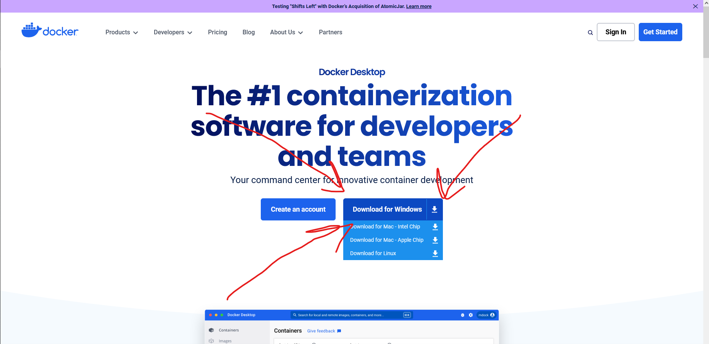

Скачиваем, устанавливаем.
Запускаем (возможно потреуется регистрация в докер-хаб)

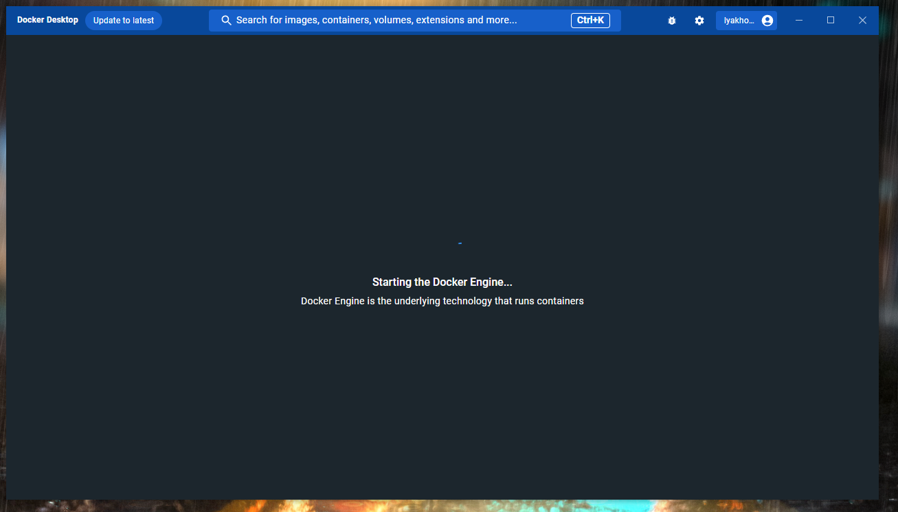

Откроется список локальных контейнеров или образов контенеров (будет пусто)

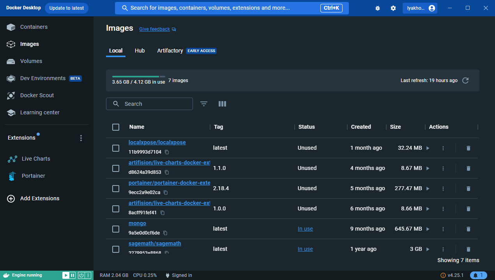

# Образ
Открываем поиск («_Search ..._»), нужен просто **sagemath** (ни к коем случае не sagemath-jupyter)

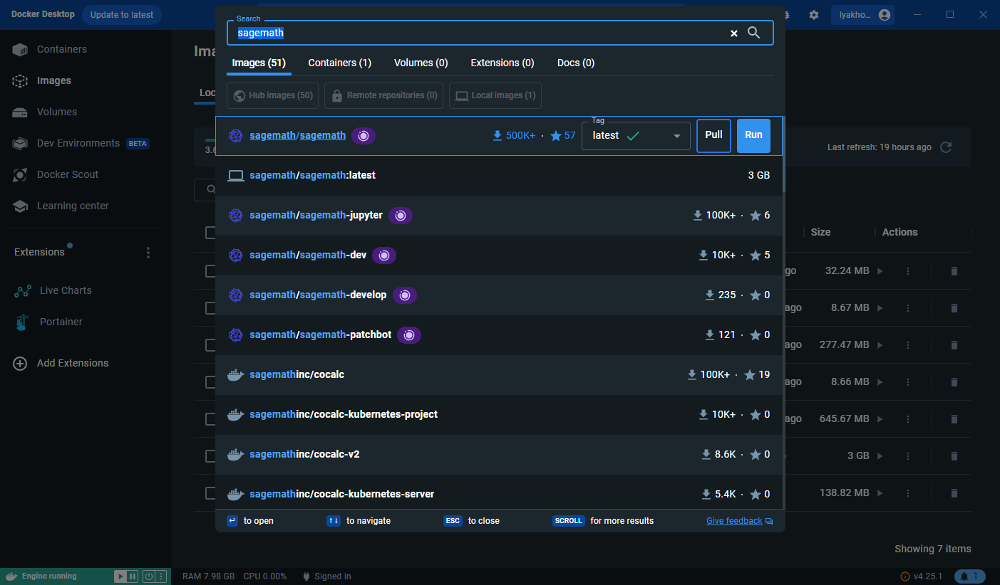
Нажимаем «Run», начнется скачивание образа
По завершении загрузки приложение предложит запустить контейнер этого образа.
**НЕ НАЖИМАЕМ КНОПКУ ЗАПУСКА («*Run*»)**.

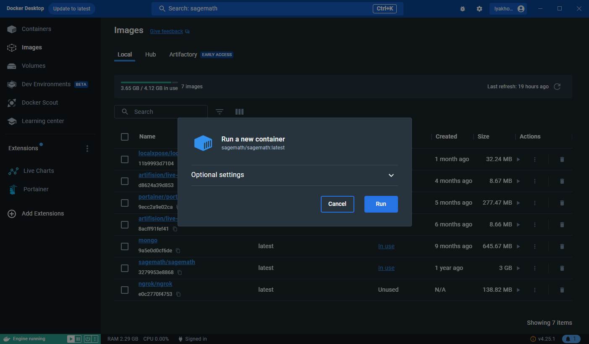

Вместо запуска отсюда нужно запустить из командной строки (здесь опций не хватает)
Открываем PowerShell, Windows Terminal, cmd не надо.

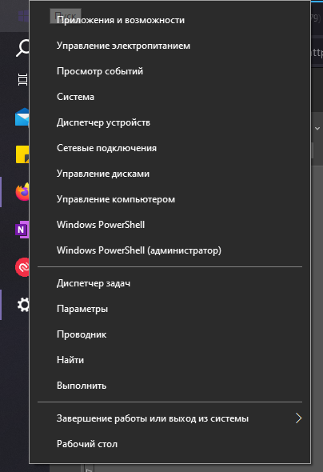

Кликаем правой кнопкой мыши по пуску и запускаем PowerShell
# Запуск
В PS нам необходимо написать следующее
```powershell
docker run -p 8888:8888 -d sagemath/sagemath:latest sage-jupyter
```
**ВСЕ ПАРАМЕТРЫ ОБЯЗАТЕЛЬНЫ**
Он подумает, выведет в ответ набор цифр и букв, значит все хорошо.

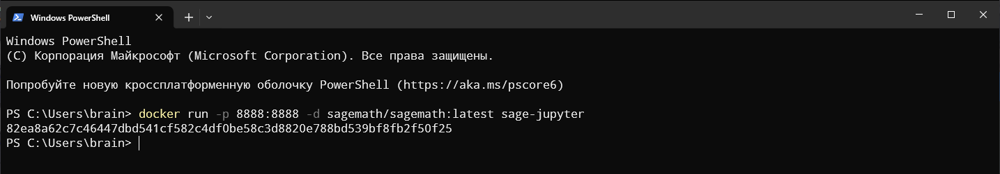

Если вдруг вышне не что-то подобное, а

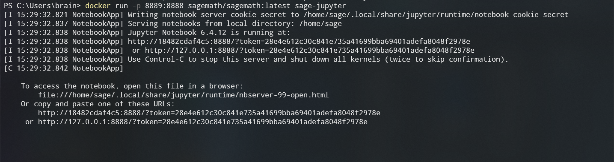

Это тоже очень хорошо, можно закрыть окно с консолью

# Используем контейнер
После этого возвращаемся в docker desktop и в списке контейнеров увидим наш (у вас он будет один)

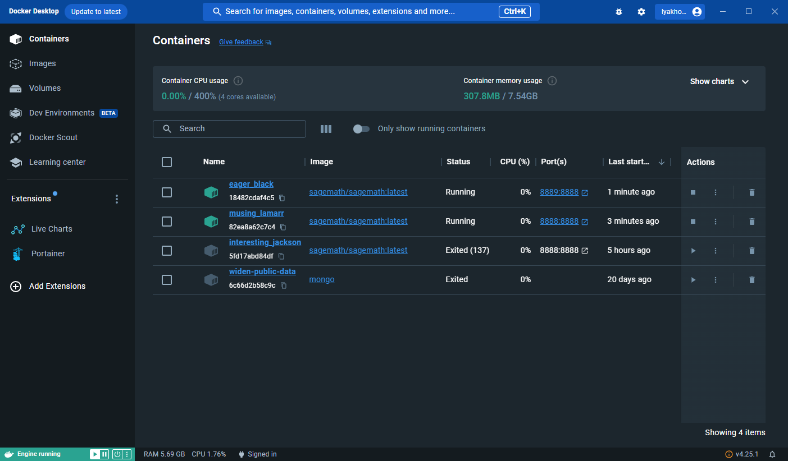

Зелененький — значит запущен. Нажимаем на строку с именем (не стоит тыкать колонку Image или кнопки).
Должно получиться что-то такое

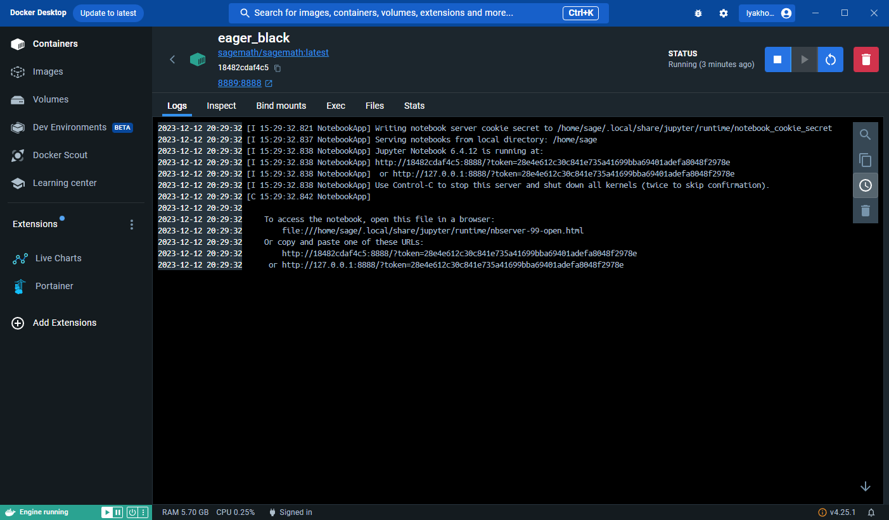

Нажимаем (прям нажимаем) на последнюю ссылку

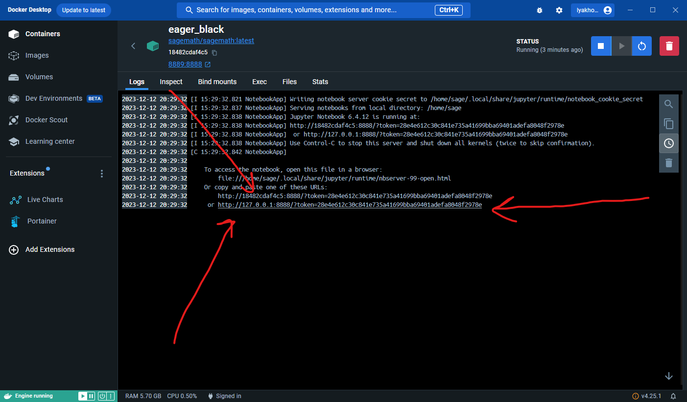

Загружается браузер и видим интерфейс jupyter notebook

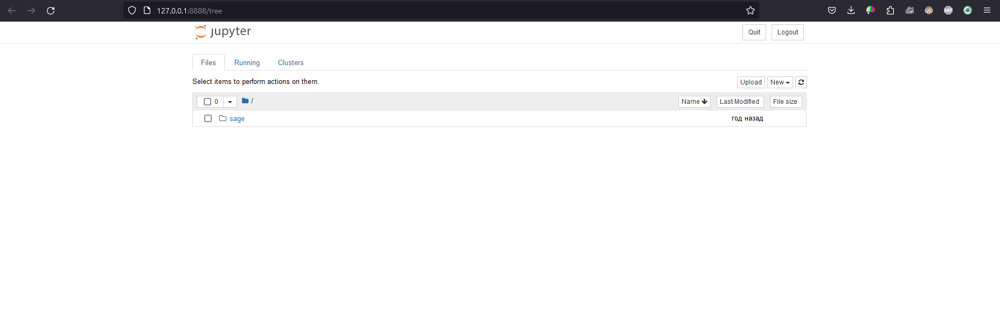

# finale
Далее отсюда все как Волочков сказал

По окончании работы с sage нужно вернуться в docker desktop и остановить контейнер. Его можно будет запустить снова (уже из docker desktop, по кнопочке, красота), если понадобится и пользоваться в дальнейшем (я расчетки по твмс делал в нем), все файлы будут сохранены.
